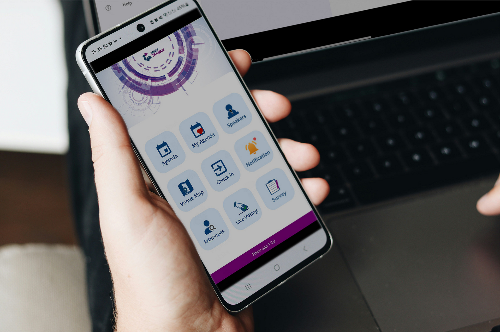

# Congress App

## Project Overview

Congress App is a comprehensive event management solution built on Microsoft PowerPlatform (PowerApps, Power Automate, Dataverse). This application enables event organizers to create events, manage schedules, speakers, and attendees with a streamlined interface and automated workflows.

The solution consists of two complementary applications:
- A back-end management PowerApp for desktop, used by event organizers to set up and administer events
- A front-end mobile PowerApp for event attendees to view schedules, register for sessions, and access event information

## Key Features

- **Event Creation and Configuration**: Easily set up new events with customizable fields for venue, date, capacity, and event type.
- **Agenda/Schedule Management**: Create and manage multi-day, multi-track event schedules.

- **Speaker Management**: Track speaker information, presentations, availability, and attendance history.
- **Attendee Registration**: Handle registrations with automated confirmation emails and attendance tracking.
- **3rd Party Questionaires and Links**: Enable in-app access to 3rd party links via iFrames.
- **Reporting and Analytics**: Generate real-time statistics on registrations, attendance, and session popularity.

## Technical Implementation

Congress App was developed using Microsoft's PowerPlatform suite:
- **PowerApps**: Provides the front-end interface with responsive design for both desktop and mobile access
- **Power Automate**: Handles workflow automation for approval processes, notifications, and data synchronization
- **Dataverse**: Serves as the secure and scalable data storage solution with complex relationship modeling
